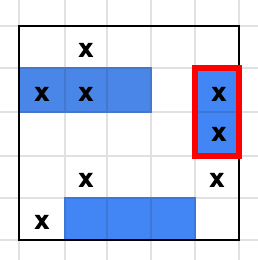
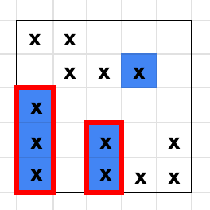

# BattleShip
A rust server for the game battle ship and example react client.

## Server Rest API

The following endpoints are defined and return/take the give data objects:

### `GET /board/{side}`

- PARAMS:
  - `side` is either 1 or 2
- RETURN (example):
```json
{
  "id": 2341,
  "boards": {
    "size": 4,
    "player": [
      0, 1, 0, 0, 0,
      3, 3, 2, 0, 4,
      0, 0, 0, 0, 4,
      0, 1, 0, 0, 1,
      1, 2, 2, 2, 0
    ],
    "enemy": [
      1, 1, 0, 0, 0,
      0, 1, 1, 3, 0,
      4, 0, 0, 0, 0,
      4, 0, 4, 0, 1,
      4, 0, 4, 1, 1
    ]
  }
}
```

This example represents the following game state:

**Player itself (left) and enemy (right)**




The numbers from the list have the following meanings:

- 0: nothing
- 1: shot but free
- 2: ship (no hit)
- 3: ship (hit)
- 4: ship (hit and destroyed)

Therefore the array `enemy` will never contain number 2. The matrix representation can be derived from the `size`. The game is always a square.